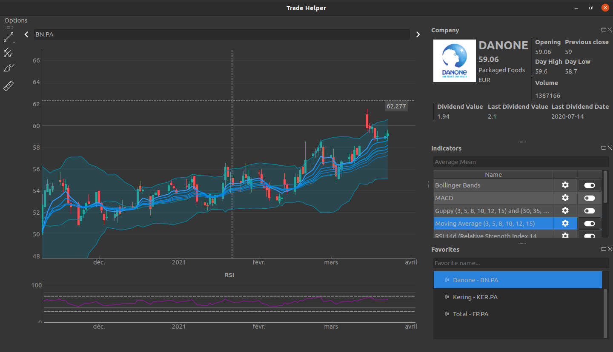

# TradeHelper

This aplication is a exercice working with Qt, PyQt arround the finance.
It is largely inspired by `TradingView` which is a wonderfull tool for finance analysis.




## Installation

1. Create a virtual environment named `venv`:

   ```bash
   $ virtualenv venv
   Running virtualenv with interpreter /usr/bin/python3.8
   Installing setuptools, pip, wheel...
   done.
   ```

2. Activate the virtual environment:

   ```bash
   $ source venv/bin/activate
   $(venv)
   ```

   After activation, you should see `(venv)` above your command prompt.

3. Use the package manager [pip](https://pip.pypa.io/en/stable/) to install requirements.txt.

    ```bash
    $(venv) pip install -r requirements.txt
    ```

3. Launch the app
    ```bash
    $(venv) python app/launcher.py
    ```

## Todo

- [ ] Continue the development.
- [ ] More asynchronous functions.
- [ ] Add other indicators
- [ ] Save users settings
- [ ] Embeded Python Console ?
- [ ] Draw over the graph
- [ ] Use Machine learning to determine patterns
- [ ] Draw Fibonnaci on Chart => 50% done
- [ ] Make Virtual Portefolio
- [ ] Avaible Trading
- [ ] SplashScreen Loading